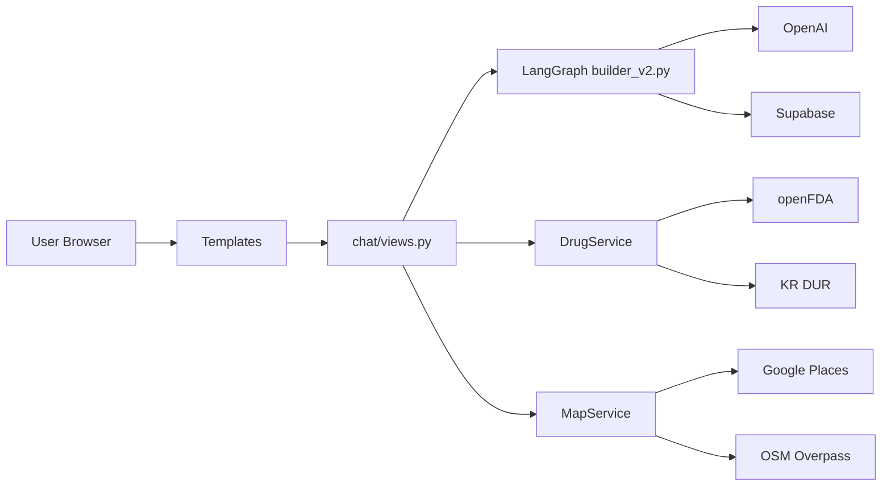

# 03. 시스템 구성도 (System Architecture)

## 기준 정보

- 기준 브랜치: `develop`
- 실행 서버: Django ASGI + Uvicorn

## 1) 아키텍처 개요

- Backend: Django (ASGI)
- Workflow: LangGraph (`graph_agent`)
- AI: OpenAI (`services/ai_service_v2.py`)
- Data: Supabase, openFDA, KR DUR
- Map: Google Places + OSM fallback

## 2) 컴포넌트 구성도

## 3) 핵심 URL

- `/` 메인
- `/smart-search/` 통합 검색
- `/smart-search-products/` 성분별 제품 추천 페이지
- `/api/pharmacies/` 위치 기반 약국 API (`lat,lng,radius,limit`)
- `/api/symptom-products/` 성분별 제품 API

## 4) 시퀀스 요약

### 증상 검색
1. 사용자 입력 → `smart_search`
2. LangGraph 분류/검색/DUR 처리
3. 결과 페이지 렌더
4. 후속 제품 API 비동기 조회

### 약국 지도
1. 브라우저 Geolocation으로 좌표 확보
2. `/api/pharmacies/` 호출
3. Google 실패 시 OSM fallback
4. 지도 핀/목록 렌더
5. 지도 이동 시 viewport 기준 재조회

## 5) 구현 포인트

- 상담 메모: 영어 생성 + 프로필 필드 영어 번역
- 지도: 현재 위치 빨간 마커, 약국 핀 hover 툴팁
- 필터: pet/vet 장소 제외
